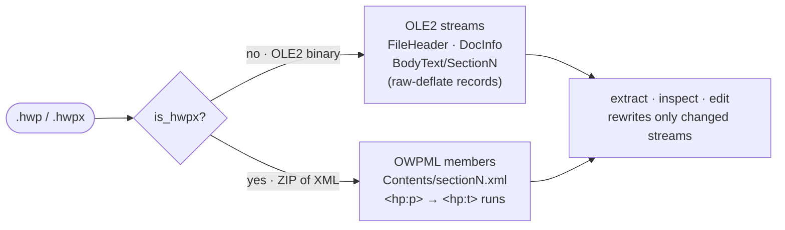

# hwp-toolkit (한국어 가이드)

*[English guide → README.md](README.md)*

**아래아한글 / 한컴오피스 문서**(`.hwp` / `.hwpx`)를 읽고, 분석하고, 편집하는
도구입니다. 관공서·학교·기업 서식에서 널리 쓰이는 한글 문서 형식을 다룹니다.

일반 도구로는 `.hwp`를 열 수 없습니다 — `.hwp`는 zip이 아니라 **OLE2 바이너리**라
`python-docx`, `unzip`, 일반 텍스트 리더가 모두 깨진 결과를 냅니다. 이 스킬은
실제 포맷을 직접 파싱합니다. 편집기는 **요청한 텍스트만 바꾸고 나머지 모든
바이트(글꼴·표·이미지·레이아웃)는 그대로 보존**하므로, 공문서 양식 채우기
(강의계획서, 사업계획서, 신청서, 공문, 결재 양식 …)에 안전하게 쓸 수 있습니다.

이 스킬은 **Claude 스킬**(에이전트가 따르는 `SKILL.md` 매뉴얼)인 동시에,
어떤 도구에서든 — 또는 사람이 직접 — 실행할 수 있는 **독립 파이썬 CLI**
(`scripts/`)입니다.

---

## 무엇을 하나

- **추출**: `.hwp`·`.hwpx` 텍스트 추출 — 표 인식(`[표]` 표시),
  다중 섹션 인식(`=== section ===` 헤더), 인라인 제어문자 정리
  (`secd`/`tbl`/`<hp:lineBreak/>` 같은 잡음이 새지 않음).
- **표 추출**: 표를 실제 2-D 격자로 추출 — 병합 셀(rowspan/colspan)과 여러
  단락으로 된 셀을 풀어 CSV·Markdown·JSON으로. 텍스트 추출이 주는 흩어진
  줄 나열이 아니라 행·열 구조가 살아 있는 표를 얻습니다.
- **검사**: 구조 분석 — 스트림 목록, 압축/암호화 여부, 레코드 태그 개수,
  정밀 편집을 위한 단락별 인덱스.
- **편집·양식 채우기**: 문서를 깨뜨리지 않고 편집 — `.hwp`·`.hwpx` 모두
  find-replace 지원, `.hwp`는 인덱스 기반 셀 설정과 빈 셀 채우기도 가능.
- **변환**: 선택 의존성 `pyhwp`로 텍스트/Markdown/HTML 변환.

---

## 요구 사항

- Python **3.10+**
- [`olefile`](https://pypi.org/project/olefile/) — 필수
  ```bash
  pip install olefile --break-system-packages
  ```
- [`pyhwp`](https://pypi.org/project/pyhwp/) — 선택(Markdown/HTML/ODT 변환 시에만)
  ```bash
  pip install pyhwp --break-system-packages
  ```

---

## 설치

### Claude Code / Claude Desktop / Cowork

스킬 폴더를 스킬 디렉터리에 넣으면 에이전트가 자동으로 인식합니다. 저장소 루트에서
실행하세요.

```bash
mkdir -p ~/.claude/skills
cp -R skills/hwp-toolkit ~/.claude/skills/
```

이미 `skills/hwp-toolkit/` 안에 있다면 이렇게 실행합니다.

```bash
mkdir -p ~/.claude/skills/hwp-toolkit
cp -R . ~/.claude/skills/hwp-toolkit/
```

특정 프로젝트에만 적용하려면 그 프로젝트의 `.claude/skills/` 아래로 복사하면
됩니다. 패키지 파일을 쓰는 앱이라면 저장소 루트에서 빌드한 뒤 **Save skill**
버튼으로 설치할 수 있습니다.

```bash
uv run python scripts/build_all.py hwp-toolkit
```

설치 후에는 `.hwp`/`.hwpx` 파일이나 "한글 문서"를 언급하기만 하면 스킬이
자동으로 동작합니다 — 특별한 문법이 필요 없습니다. `/hwp-toolkit`으로 직접
호출할 수도 있습니다.

### Codex CLI, Cursor, 그 밖의 셸 실행 가능한 에이전트

Claude 전용 마법은 없습니다 — `scripts/`는 의존성이 `olefile` 하나뿐인 평범한
파이썬 CLI입니다. 다른 코딩 에이전트에서 쓰려면:

1. `scripts/`를 프로젝트 안(또는 근처)에 복사합니다.
2. `pip install olefile` 합니다.
3. 에이전트가 이 스크립트를 쓰도록 안내합니다. Codex/Cursor라면 `AGENTS.md`
   또는 프로젝트 규칙에 몇 줄 추가하면 됩니다. 예:

   > `.hwp`/`.hwpx` 파일은 `tools/hwp-toolkit/`의 스크립트를 사용할 것:
   > 읽기는 `hwp_extract.py`, 편집 위치 찾기는 `hwp_inspect.py --paragraphs`,
   > 양식 채우기는 `hwp_edit.py replace IN OUT --pair "OLD" "NEW"`.
   > 표준 라이브러리는 `.hwp`에서 **동작하지 않음**.

   전체 플레이북이 필요하면 `SKILL.md`를 에이전트 컨텍스트에 붙여 넣습니다.

### 사람이 직접 사용

CLI 자체로도 충분히 유용합니다. 의존성을 설치한 뒤 아래 **스크립트 직접 실행**을
참고하세요.

```bash
pip install olefile
```

---

## 사용법

이 스킬은 **에이전트에게 평범한 말로 시키는 것**이 기본 사용법입니다. 명령을
외우거나 옵션을 익히거나 터미널을 열 필요가 없습니다 — `.hwp`/`.hwpx` 파일을
가리키고 원하는 바를 한 문장으로 말하면, 에이전트가 스킬을 읽고 알아서
처리합니다. CLI 스크립트는 자동화나 직접 실행을 위해 그대로 있지만
([아래](#스크립트-직접-실행)), 대부분은 쓸 일이 없습니다.

### 그냥 에이전트에게 말하세요

스킬을 설치했거나 에이전트에 [`SKILL.md`](SKILL.md)를 알려줬다면, 동료에게
부탁하듯 작업을 설명하면 됩니다. 에이전트가 알맞은 도구를 골라 순서대로 실행하고
결과를 돌려줍니다 — 편집은 원본을 덮어쓰지 않고 **새 파일**로 만듭니다.

**읽기·요약**

- “이 위임장.hwp에서 텍스트만 뽑아줘.”
- “사업계획서.hwp를 다섯 줄로 요약해줘.”
- “이 폐업신고서.hwpx 내용을 **표까지 포함해서** 정리해줘.”
- “예산안.hwp의 표를 CSV로 뽑아줘 (병합된 칸도 살려서).”
- “보고서.hwp를 깔끔한 Markdown으로 변환해줘.”

**양식·템플릿 채우기** — 가장 흔한 요청

- “강의계획서.hwp 양식에서 강좌명을 ‘온디바이스 LLM 실습’으로 채워줘.”
- “이 신청서.hwp에 신청인은 홍길동, 연락처는 010-1234-5678로 넣어줘.”
- “강의계획서.hwp의 강사명을 내 이름으로 채우고 사본으로 저장해줘.”

**문서 전체 찾아 바꾸기**

- “문서 전체에서 ‘OOO’를 ‘온디바이스’로 바꿔줘.”
- “계약서.hwpx에서 ‘(주)예시’를 모두 ‘(주)멤투멤’으로 바꿔줘.”

**에이전트가 대신 해주는 일.** 먼저 문서를 검사해(플레이스홀더의 앞 공백과
`ㅇ`/`*` 불릿까지 정확히 맞추려고) 요청한 텍스트만 바꾸고 결과를 검증합니다.
**글꼴·표·이미지·페이지 레이아웃은 바이트 단위로 그대로** 유지되고, 바뀌는 것은
요청한 글자뿐입니다.

**깔끔한 결과를 얻으려면**

- 특정 파일을 가리키세요(끌어다 놓거나 경로 제공). 양식은 **항목과 값**으로
  말하세요(“강좌명 → 온디바이스 LLM 실습”). 원본 플레이스홀더 문구를 추측할
  필요 없이 에이전트가 찾아냅니다.
- 표가 있는 문서는 “표 포함”이라고 명시하세요.
- 파일을 쓰기 전에 **채워진 텍스트를 다시 보여달라**고 해서 제자리에 들어갔는지
  확인하세요.
- 표가 많은 양식은 단순 추출 텍스트나 파일 미리보기만 보지 말고, HTML처럼 표
  배치를 보존하는 결과로 검증해 달라고 하세요.
- “안 바뀐다”면 거의 항상 공백·불릿 불일치입니다 —
  [문제 해결](#문제-해결)을 참고하세요.

**할 수 없는 것.** 이미 있는 칸만 채웁니다. `.hwp`에서 아직 텍스트 레코드가
없는 빈 칸 일부는 채울 수 있지만, 새 표 행·이미지는 추가하지 못하므로 템플릿에
필요한 항목이 모두 있어야 합니다(또는 한글에서 행을 먼저 추가한 뒤 요청). 암호
보호 파일은 열 수 없으며, 에이전트가 이를 알리고 한글에서 암호를 해제해 다시
보내달라고 요청합니다. 전체 표는 [기능과 한계](#기능과-한계)에 있습니다.

### 스크립트 직접 실행

명령줄을 선호하거나 에이전트 없이 자동화하나요? 위와 같은 단계를 평범한 CLI로
실행하면 됩니다 — `scripts/` 디렉터리에서 실행하세요(`hwp_lib`를 import 함):

```bash
cd scripts

python hwp_extract.py FILE.hwp                    # 텍스트 읽기(.hwpx 자동 감지)
python hwp_tables.py  FILE.hwp -f csv             # 표를 실제 격자로(md/csv/json)
python hwp_inspect.py FILE.hwp --paragraphs       # 편집 전 검사: 정확한 플레이스홀더 + 인덱스

# 양식 채우기 — --paragraphs 출력에서 플레이스홀더를 그대로 복사
python hwp_edit.py replace IN.hwp OUT.hwp \
  --pair " ㅇ 강좌명 : " " ㅇ 강좌명 : 온디바이스 LLM 실습"
python hwp_edit.py replace IN.hwp OUT.hwp --rules rules.json   # 여러 규칙을 한 번에

# 모호한 플레이스홀더는 인덱스로 정밀 지정(.hwp 전용)
python hwp_edit.py set IN.hwp OUT.hwp --edits edits.json

# inspect가 blank_paragraphs로 보고한 빈 .hwp 칸 채우기
python hwp_edit.py fill-blank IN.hwp OUT.hwp --edits blanks.json

python hwp_extract.py OUT.hwp                      # 검증
```

`rules.json` → `[{"old":"OOO","new":"온디바이스","max":1,"regex":false}]` ·
`edits.json` → `{"BodyText/Section0": {"96":"홍 길 동","144":"■"}}` ·
`blanks.json` → `{"BodyText/Section0": {"36":"홍 길 동"}}`. 같은 `replace`
명령은 `.hwpx`에도 동작합니다(자동 감지). 모든 옵션은
[`SKILL.md`](SKILL.md)에 정리되어 있습니다.

---

## 기능과 한계

| | `.hwp` | `.hwpx` |
|---|:---:|:---:|
| 텍스트 추출(표·다중 섹션·제어문자 정리) | ✅ | ✅ |
| 표를 구조화된 격자로 추출(CSV/Markdown/JSON) | ✅ | ✅ |
| 스트림/압축/암호화/메타데이터 검사 | ✅ | ✅ (zip 멤버) |
| find-replace 양식 채우기 | ✅ | ✅ |
| 레코드 인덱스로 셀 설정 | ✅ | ⛔ (find-replace 사용) |
| 텍스트 레코드가 없는 기존 빈 셀 채우기 | ✅ | ⛔ |
| Markdown/HTML 변환(`pyhwp`) | ✅ | — |
| **새** 단락 / 표 행 / 이미지 삽입 | ⛔ | ⛔ |
| 암호 보호 문서 | ⛔ 감지 후 거부 | ⛔ |

편집기는 **이미 존재하는 칸만** 채웁니다. `fill-blank`는 기존 빈 `.hwp` 단락
슬롯에 빠진 텍스트 레코드를 넣을 수 있지만, 새 표 행이나 제어 객체는 만들 수
없습니다. 필요한 필드가 모두 있도록 템플릿을 설계하거나 한글에서 먼저 행을
추가하세요. `.hwpx`의 find-replace는 `<hp:t>` 텍스트 런 단위로 매칭하므로,
플레이스홀더는 한 런 안에 이어져 있어야 합니다(`<hp:lineBreak/>`나 글꼴 변경으로
끊긴 문자열은 매칭 안 됨).

---

## 문제 해결

| 증상 | 원인과 해결 |
|---|---|
| `replace`가 **0건 치환** 보고 | `old` 문자열이 문서와 정확히 일치하지 않음. `hwp_inspect.py --paragraphs` 출력에서 앞 공백과 `ㅇ`/`*`/`■` 불릿까지 그대로 복사하세요. |
| 빈 값 칸이 `--paragraphs`에 보이지 않음 | 일부 빈 `.hwp` 셀은 `PARA_HEADER`만 있고 `PARA_TEXT`가 없습니다. `hwp_inspect.py --json` 또는 `--paragraphs`의 `blank paragraphs` 섹션에서 헤더 인덱스를 찾아 `hwp_edit.py fill-blank`으로 채우세요. 옆 라벨 문단을 덮어쓰면 안 됩니다. |
| 본문은 바뀐 것 같은데 미리보기는 빈 양식처럼 보임 | 저수준 편집 뒤 `PrvText`/`PrvImage` 미리보기 스트림이 오래된 상태일 수 있습니다. `hwp_extract.py`와, 표 양식은 `hwp5html`로 검증하고 파일 관리자 미리보기만 믿지 마세요. |
| `.hwpx` 치환이 아무것도 안 바뀜 | 플레이스홀더가 `<hp:lineBreak/>`·탭·글꼴 변경으로 두 `<hp:t>` 런에 걸쳐 나뉜 경우. 대상 텍스트를 한 런 안에 이어 두거나 한글에서 먼저 수정하세요. |
| 추출 텍스트가 깨지거나 `secd`, `tbl` 잡음 | 표준 도구로 `.hwp`를 읽고 있는 것. `hwp_extract.py`를 쓰면 여러 단위로 된 인라인 제어문자를 건너뜁니다. |
| **암호화 / 암호 보호** 파일 | 감지 후 거부 — 복호화는 없습니다. 한글에서 열어 암호를 해제(보안 ▸ 문서 암호화 해제)하고 비보호 사본을 저장한 뒤 그 파일로 실행하세요. |
| `pip install`이 *externally-managed-environment*로 실패 | 관리형 파이썬(Homebrew/시스템). `--break-system-packages`를 붙이거나 가상환경을 쓰세요. |
| `ModuleNotFoundError: hwp_lib` | 스크립트를 `scripts/` 디렉터리에서 실행하세요(`cd scripts`). CLI가 공용 라이브러리를 상대 경로로 import 합니다. |

---

## 두 포맷의 차이

`.hwp`와 `.hwpx`는 서로 다른 컨테이너입니다. 툴킷은 `is_hwpx()`로 분기해 각각을
원래 방식대로 처리합니다:



표준 도구는 zip이나 Word XML을 가정하므로 `.hwp`의 OLE2 갈래에서 완전히
실패합니다 — 이 툴킷이 메우는 빈틈입니다.

---

## 안전성 원리

- **바이트 보존.** `.hwp` 편집은 바뀐 `BodyText` 스트림만 다시 쓰고(나머지는
  바이트 동일), `.hwpx` 편집은 바뀐 `Contents/section*.xml`만 다시 쓰고 나머지
  zip 멤버는 그대로 복사합니다(`mimetype`은 맨 앞·무압축 유지). 글꼴·표·이미지·
  미리보기 썸네일이 손상되지 않습니다.
- **암호화 문서**는 망가뜨리지 않고 감지해 거부합니다.
- 처음부터 생성한 픽스처로 [`tests/hwp_toolkit/`](../../tests/hwp_toolkit/)에서
  테스트합니다 — 제3자 문서를 번들하지 않습니다.

포맷 내부 구조(레코드, 압축, 인라인 제어문자 인코딩, 편집기가 건드리는 정확한
바이트)는 [`references/hwp_format.md`](references/hwp_format.md)를, 에이전트가
따르는 전체 매뉴얼은 [`SKILL.md`](SKILL.md)를 참고하세요.
