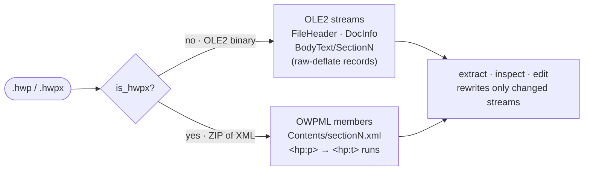

# hwp-toolkit

*[한국어 가이드 → README.ko.md](README.ko.md)*

Read, analyze, and edit **Hangul Word Processor** documents (`.hwp` / `.hwpx`,
아래아한글 / 한컴오피스) — the Korean office format used across Korean government,
school, and business paperwork.

Standard tools fail on `.hwp`: it is an **OLE2 compound binary**, not a zip, so
`python-docx`, `unzip`, and plain text readers all produce garbage. This skill
parses the real format. Its editor changes only the text you ask for and keeps
**every other byte — fonts, tables, images, layout — identical**, which is what
makes it safe for filling official form templates (강의계획서, 사업계획서, 신청서,
공문, 결재 양식 …).

This is both a **Claude skill** (a `SKILL.md` manual your agent follows) and a
set of **standalone Python CLIs** (`scripts/`) that any tool — or you — can run.

---

## What it does

- **Extract** text from `.hwp` and `.hwpx` — table-aware (`[표]` markers),
  multi-section-aware (`=== section ===` headers), and inline-control-clean
  (no leaked `secd`/`tbl`/`<hp:lineBreak/>` noise).
- **Extract tables** as a real 2-D grid — resolves merged cells
  (rowspan/colspan) and multi-paragraph cells into CSV, Markdown, or JSON,
  instead of the loose run of lines plain text extraction gives you.
- **Inspect** structure: streams, compression/encryption flags, record-tag
  counts, and per-paragraph indices for precise editing.
- **Edit / fill forms** without breaking the document: find-replace on both
  `.hwp` and `.hwpx`, plus index-based cell setting and blank-cell filling on
  `.hwp`.
- **Convert** to text/Markdown/HTML via the optional `pyhwp` toolchain.

---

## Requirements

- Python **3.10+**
- [`olefile`](https://pypi.org/project/olefile/) — required
  ```bash
  pip install olefile --break-system-packages
  ```
- [`pyhwp`](https://pypi.org/project/pyhwp/) — optional, only for
  Markdown/HTML/ODT conversion (`pip install pyhwp --break-system-packages`)

---

## Install

### Claude Code / Claude Desktop / Cowork

Drop the skill folder into a skills directory and your agent picks it up
automatically. From the repository root:

```bash
mkdir -p ~/.claude/skills
cp -R skills/hwp-toolkit ~/.claude/skills/
```

If you are already inside `skills/hwp-toolkit/`, use:

```bash
mkdir -p ~/.claude/skills/hwp-toolkit
cp -R . ~/.claude/skills/hwp-toolkit/
```

To scope it to one project, copy the folder into that project's
`.claude/skills/` directory instead. You can also build the packaged
`dist/hwp-toolkit.skill` from the repository root and use the app's **Save
skill** button:

```bash
uv run python scripts/build_all.py hwp-toolkit
```

Once installed, just mention a `.hwp`/`.hwpx` file or a "한글 문서" and the skill
triggers — no special syntax needed. You can also invoke it explicitly with
`/hwp-toolkit`.

### Codex CLI, Cursor, or any shell-capable agent

There is no Claude-specific magic here — the `scripts/` are ordinary Python
CLIs whose only dependency is `olefile`. To let another coding agent use them:

1. Copy `scripts/` somewhere in (or near) your project.
2. `pip install olefile`.
3. Point your agent at them. For Codex/Cursor, add a few lines to your
   `AGENTS.md` / project rules, e.g.:

   > For any `.hwp`/`.hwpx` file, use the scripts in `tools/hwp-toolkit/`:
   > `hwp_extract.py` to read, `hwp_inspect.py --paragraphs` to find edit
   > targets, `hwp_edit.py replace IN OUT --pair "OLD" "NEW"` to fill forms.
   > Standard libraries do **not** work on `.hwp`.

   Optionally paste `SKILL.md` into the agent's context for the full playbook.

### Directly, as a human

The CLIs are useful on their own. Install the dependency, then see
**Running the scripts directly** below:

```bash
pip install olefile
```

---

## Usage

The normal way to use this skill is to **talk to your agent in plain language**.
You don't run commands, learn flags, or open a terminal — point the agent at a
`.hwp`/`.hwpx` file, say what you want in a sentence, and it reads the skill and
does the rest. The CLI scripts still exist for automation or hands-on use
([below](#running-the-scripts-directly)), but most people never touch them.

### Just ask your agent

Once the skill is installed (or you've pointed your agent at [`SKILL.md`](SKILL.md)),
describe the task the way you'd describe it to a coworker. The agent picks the
right tool, runs the steps in order, and gives you the result — for edits, a
**new file**, never overwriting your original.

**Read or summarize**

- “이 위임장.hwp에서 텍스트만 뽑아줘.”
- “사업계획서.hwp를 다섯 줄로 요약해줘.”
- “이 폐업신고서.hwpx 내용을 **표까지 포함해서** 정리해줘.”
- “예산안.hwp의 표를 CSV로 뽑아줘 (병합된 칸도 살려서).”
- “Convert 보고서.hwp to clean Markdown.”

**Fill in a form or template** — the most common request

- “강의계획서.hwp 양식에서 강좌명을 ‘온디바이스 LLM 실습’으로 채워줘.”
- “이 신청서.hwp에 신청인은 홍길동, 연락처는 010-1234-5678로 넣어줘.”
- “Fill the instructor field in lecture-plan.hwp with my name and save a copy.”

**Find and replace across the whole document**

- “문서 전체에서 ‘OOO’를 ‘온디바이스’로 바꿔줘.”
- “계약서.hwpx에서 ‘(주)예시’를 모두 ‘(주)멤투멤’으로 바꿔줘.”

**What the agent does for you.** It inspects the document first (so it matches
your placeholders exactly — spacing and `ㅇ`/`*` bullets matter), changes only
the text you asked for, and verifies the output. **Fonts, tables, images, and
page layout stay byte-for-byte identical** — only your words change.

**How to get a clean result**

- Point at a specific file (drag it in or give the path). For forms, name the
  **field and the value** (“강좌명 → 온디바이스 LLM 실습”) instead of guessing the raw
  placeholder text — the agent finds the placeholder for you.
- If the document has tables, ask for them explicitly (“표 포함”).
- Ask the agent to **show you the filled text back** before you use the file, so
  you can confirm it landed in the right place.
- For table-heavy forms, ask the agent to verify with table-preserving output
  such as HTML, not only plain extracted text or file-manager previews.
- If something “didn't replace,” it's almost always a spacing/bullet mismatch —
  see [Troubleshooting](#troubleshooting).

**What it can't do.** It fills slots that already exist, including some blank
`.hwp` cells that have no text record yet; it can't add new table rows or images
— the template needs every field present first (or add rows in Hangul, then
ask). Password-protected files can't be opened: the agent tells you and asks you
to remove the password in Hangul and resend. Full matrix in
[Capabilities & limits](#capabilities--limits).

### Running the scripts directly

Prefer the command line, or scripting this without an agent? The same steps are
plain CLIs — run them from the `scripts/` directory (they import `hwp_lib`):

```bash
cd scripts

python hwp_extract.py FILE.hwp                    # read text (.hwpx auto-detected)
python hwp_tables.py  FILE.hwp -f csv             # tables as a real grid (md/csv/json)
python hwp_inspect.py FILE.hwp --paragraphs       # inspect first: exact placeholders + indices

# fill a form — copy the placeholder verbatim from --paragraphs
python hwp_edit.py replace IN.hwp OUT.hwp \
  --pair " ㅇ 강좌명 : " " ㅇ 강좌명 : 온디바이스 LLM 실습"
python hwp_edit.py replace IN.hwp OUT.hwp --rules rules.json   # many rules at once

# precise control for ambiguous placeholders (.hwp only)
python hwp_edit.py set IN.hwp OUT.hwp --edits edits.json

# fill a blank .hwp cell that inspect reports under blank_paragraphs
python hwp_edit.py fill-blank IN.hwp OUT.hwp --edits blanks.json

python hwp_extract.py OUT.hwp                      # verify
```

`rules.json` → `[{"old":"OOO","new":"온디바이스","max":1,"regex":false}]` ·
`edits.json` → `{"BodyText/Section0": {"96":"홍 길 동","144":"■"}}` ·
`blanks.json` → `{"BodyText/Section0": {"36":"홍 길 동"}}`. The same `replace`
command works on `.hwpx` (auto-detected). Every flag is documented in
[`SKILL.md`](SKILL.md).

---

## Capabilities & limits

| | `.hwp` | `.hwpx` |
|---|:---:|:---:|
| Extract text (tables, multi-section, clean controls) | ✅ | ✅ |
| Extract tables as a structured grid (CSV/Markdown/JSON) | ✅ | ✅ |
| Inspect streams / compression / encryption / metadata | ✅ | ✅ (zip members) |
| Find-replace form filling | ✅ | ✅ |
| Set cell by record index | ✅ | ⛔ (use find-replace) |
| Fill existing blank cell with no text record | ✅ | ⛔ |
| Convert to Markdown/HTML (`pyhwp`) | ✅ | — |
| Insert **new** paragraphs / table rows / images | ⛔ | ⛔ |
| Password-protected files | ⛔ detected & refused | ⛔ |

The editor fills slots that already exist; `fill-blank` can insert the missing
text record for an existing blank `.hwp` paragraph slot, but it can’t create new
table rows or controls. Design templates so every field is present, or add rows
in Hangul first. On `.hwpx`, find-replace matches per `<hp:t>` text run, so keep
each placeholder contiguous in one run (a string split by a `<hp:lineBreak/>` or
a font change won’t match).

---

## Troubleshooting

| Symptom | Cause & fix |
|---|---|
| `replace` reports **0 replacements** | The `old` string doesn't match the document byte-for-byte. Copy the placeholder — including leading spaces and `ㅇ`/`*`/`■` bullets — straight from `hwp_inspect.py --paragraphs`. |
| Blank form value is missing from `--paragraphs` | Some blank `.hwp` cells have `PARA_HEADER` but no `PARA_TEXT`. Use `hwp_inspect.py --json` or the `blank paragraphs` section from `--paragraphs`, then fill that header with `hwp_edit.py fill-blank`; do not overwrite the neighbouring label paragraph. |
| Edited body looks correct, but preview still looks blank | Low-level edits may leave `PrvText`/`PrvImage` preview streams stale. Verify with `hwp_extract.py` and, for tables, `hwp5html`; do not rely on file-manager previews alone. |
| `.hwpx` replace changes nothing | The placeholder is split across runs by a `<hp:lineBreak/>`, a tab, or a font change, so it spans two `<hp:t>` segments. Keep the target text contiguous in one run, or edit in Hangul first. |
| Extracted text is garbled / full of `secd`, `tbl` noise | You're reading `.hwp` with a standard tool. Use `hwp_extract.py` — it skips the multi-unit inline controls that naive readers leak. |
| **Encrypted / password-protected** file | Detected and refused — there is no decryption. Open it in Hangul, remove the password (보안 ▸ 문서 암호화 해제), save an unprotected copy, and run the tool on that. |
| `pip install` fails with *externally-managed-environment* | Managed Python (Homebrew/system). Add `--break-system-packages`, or use a virtualenv. |
| `ModuleNotFoundError: hwp_lib` | Run the scripts from the `scripts/` directory (`cd scripts`) — the CLIs import the shared library by relative path. |

---

## How the two formats differ

`.hwp` and `.hwpx` are unrelated containers; the toolkit branches on
`is_hwpx()` and handles each natively:



Standard tools assume a zip or Word XML, so they fail on the `.hwp` OLE2 branch
entirely — that's the gap this toolkit fills.

---

## How it stays safe

- **Byte-preservation.** `.hwp` edits rewrite only the changed `BodyText`
  stream (everything else byte-identical); `.hwpx` edits rewrite only the
  changed `Contents/section*.xml` and copy every other zip member verbatim
  (the `mimetype` stays first and uncompressed). Your fonts, tables, images,
  and preview thumbnail are untouched.
- **Encrypted files** are detected and refused rather than mangled.
- Tested via [`tests/hwp_toolkit/`](../../tests/hwp_toolkit/) against fixtures
  generated from scratch — no third-party documents are bundled.

For format internals (records, compression, the inline-control encoding, the
exact bytes the editor touches), see
[`references/hwp_format.md`](references/hwp_format.md). The full manual the
agent follows is [`SKILL.md`](SKILL.md).
